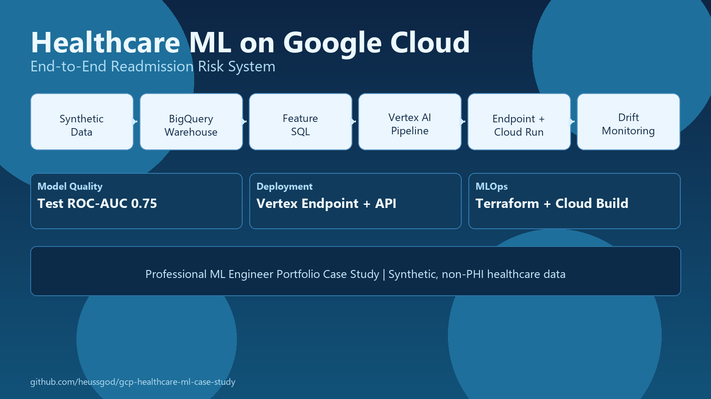
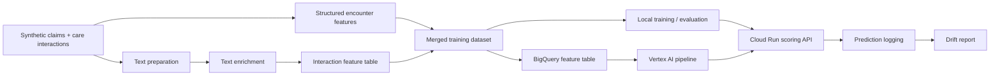

# Healthcare Outreach Triage on Google Cloud

Production-style healthcare ML case study for post-discharge outreach triage. The pipeline starts with synthetic encounter and communication data, derives text and structured features, trains a readmission-risk model, and carries the artifact through a Google Cloud deployment path with online scoring and drift reporting.

Instead of stopping at a notebook, the repo treats the model as one part of a broader system: data preparation, feature generation, service deployment, and monitoring. The emphasis is on engineering judgment for healthcare-adjacent workflows rather than on a single benchmark number.

## Why This Matters

Outreach prioritization sits at the intersection of noisy documentation, operational constraints, and model risk. This repo shows how structured clinical signals and free-text interactions can be combined in a reproducible cloud workflow without overstating what a synthetic-data prototype can prove.

## Overview



## Key Features

- Synthetic discharge follow-up dataset with structured encounters plus free-text interactions
- Text preparation pipeline with de-identification and abbreviation expansion
- Heuristic or Google Natural Language API enrichment path for symptom and barrier signals
- Feature build step that merges text-derived signals with structured encounter features
- Logistic regression baseline for 30-day readmission risk
- Vertex AI training and endpoint deployment path
- Cloud Run scoring API
- Drift report generation from baseline and production tables

## Architecture



## Technical Stack

- Python 3.13
- Pandas, NumPy, scikit-learn
- BigQuery, Vertex AI, Cloud Run, Cloud Build
- FastAPI
- Terraform
- Pytest

## Results

Metrics below come from the bundled local synthetic-data run in `model/metrics_local.json`.

| split | ROC-AUC | PR-AUC | Brier | F1 |
| --- | ---: | ---: | ---: | ---: |
| train | 0.892 | 0.362 | 0.145 | 0.406 |
| val | 0.892 | 0.412 | 0.139 | 0.442 |
| test | 0.888 | 0.345 | 0.156 | 0.382 |

These numbers are useful as a systems sanity check, not as a claim about clinical performance. The dataset is synthetic and the enrichment path is intentionally lightweight.

## Local Setup

Core local workflow:

```powershell
py -3.13 -m venv .venv
.\.venv\Scripts\Activate.ps1
python -m pip install --upgrade pip
pip install -e .[dev]
```

Full cloud-enabled install:

```powershell
pip install -e .[cloud,dev]
```

Or install the full stack from `requirements.txt`:

```powershell
pip install -r requirements.txt
```

## Quickstart

Fastest local demo:

```powershell
powershell -ExecutionPolicy Bypass -File scripts/run_local_demo.ps1
```

That script:

1. Generates synthetic structured and text data
2. Prepares the text records
3. Enriches interaction text with ML-style signals
4. Builds the merged feature dataset
5. Trains the local model
6. Writes metrics to `model/metrics_local.json`

## Manual Pipeline

### Generate synthetic data

```powershell
python -m healthcare_ml.data.generate_synthetic `
  --rows 12000 `
  --output data/raw/claims_events.csv `
  --interactions-output data/raw/care_interactions.csv
```

### Prepare text

```powershell
python -m healthcare_ml.prep.prepare_interactions `
  --input-csv data/raw/care_interactions.csv `
  --output-jsonl data/prepared/care_interactions.jsonl
```

### Enrich text

Local heuristic path:

```powershell
python -m healthcare_ml.apis.text_enrichment `
  --input-jsonl data/prepared/care_interactions.jsonl `
  --output-jsonl data/enriched/care_interactions.jsonl `
  --provider heuristic
```

Google Cloud path:

```powershell
gcloud auth application-default login
python -m healthcare_ml.apis.text_enrichment `
  --input-jsonl data/prepared/care_interactions.jsonl `
  --output-jsonl data/enriched/care_interactions.jsonl `
  --provider google
```

### Build the training dataset

```powershell
python -m healthcare_ml.features.build_feature_dataset `
  --claims-csv data/raw/claims_events.csv `
  --enrichment-jsonl data/enriched/care_interactions.jsonl `
  --output-csv data/processed/training_dataset.csv `
  --interaction-features-output data/processed/interaction_features.csv
```

### Train locally

```powershell
python -m healthcare_ml.training.train_local `
  --input-csv data/processed/training_dataset.csv `
  --model-output model/model_local.joblib `
  --metrics-output model/metrics_local.json
```

## Deployment Path

The repo includes:

- BigQuery loaders for structured and text-derived features
- SQL for building the joined training table
- Vertex AI pipeline compilation and submission
- Endpoint deployment helper
- Cloud Build config for the serving API
- Terraform for core infrastructure scaffolding

Example Cloud Run request payload:

```json
{
  "age": 68,
  "sex": "F",
  "payer_type": "Medicare",
  "comorbidity_score": 4.1,
  "prior_admissions_180d": 2,
  "ed_visits_90d": 1,
  "avg_length_of_stay": 5.2,
  "med_count": 11,
  "discharge_disposition": "SNF",
  "zip_svi": 0.64,
  "interaction_count": 3,
  "avg_sentiment_score": -0.55,
  "urgent_symptom_mentions": 2,
  "medication_barrier_flag": 1,
  "followup_barrier_flag": 1,
  "social_barrier_flag": 0,
  "positive_recovery_flag": 0
}
```

## Tests

```powershell
pytest
```

## Project Structure

```text
gcp_healthcare_ml_case_study/
  cloudbuild/
  config/
  data/
  infra/terraform/
  model/
  scripts/
  sql/
  src/healthcare_ml/
  tests/
```

## Limitations

- All data is synthetic and contains no PHI.
- The heuristic text enrichment path is a local development stand-in, not a substitute for a clinical NLP model.
- The baseline model is intentionally simple; the point of the repo is the end-to-end system, not leaderboard performance.

## Roadmap

- Add model calibration analysis and threshold selection artifacts
- Log prediction requests for a fuller monitoring demo
- Add a lightweight dashboard for drift and operating-point review
